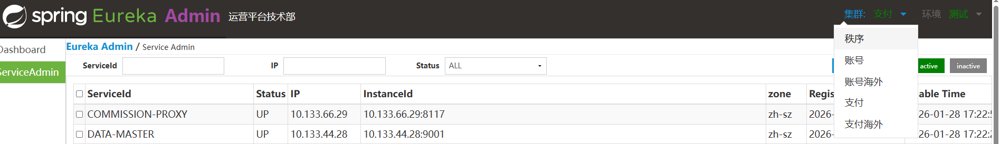
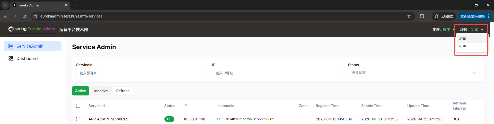
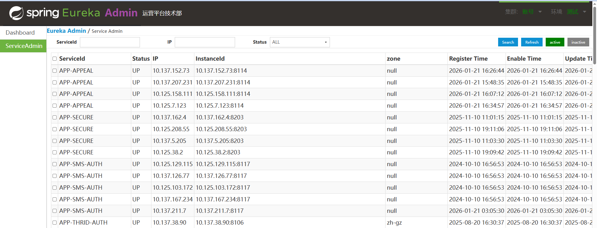
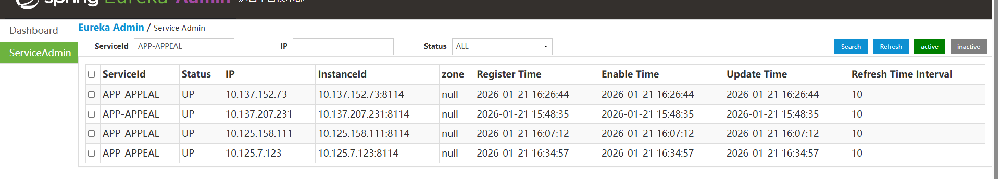
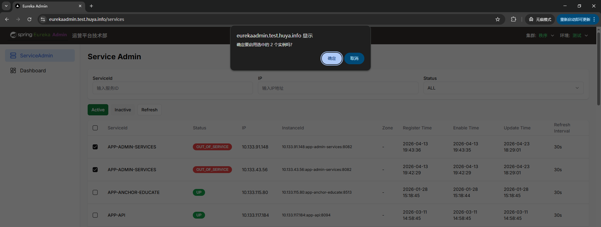
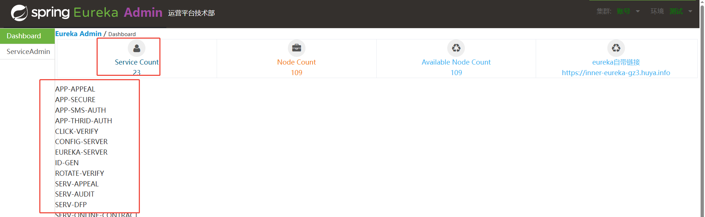
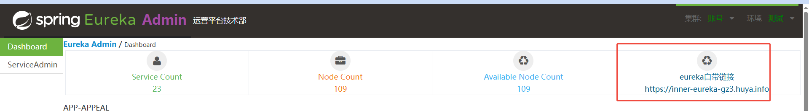

[toc]
# 项目背景
- eureka是一个springcloud较为通用流行的服务注册发现中心
- eureka目前仅仅配套了查询页面，没有配套摘除节点流量和放节点流量的功能
- 而在实际排查或者处理问题过程中，会频繁需要使用摘除流量保存节点现场的功能
- 上面就是这个项目产生的背景:eureka-admin
- 项目没有太多难点，主要是全栈这块：前端web和后端都有

# 简单使用
- 选择集群

- 选择环境

- 查询服务列表/刷新页面

- 搜索eureka上服务节点列表（服务名、ip、状态）（纯前端实现）

- 批量摘除节点流量和放节点流量

- 查询总的服务数量

- 跳转到eureka自带的管理界面

# 交互流程

## 技术关键点
- springboot 3.4.5  && jdk25
- api实现而不是eurkea client(降低依赖更加灵活)
- 配置化实现多集群的选择能力
- 前端框架vue(todo)

# 具体使用
## 访问地址
- 本地访问：http://127.0.0.1:11111/ 或者：http://eureka-local.com:11111/eurekaindex.html

## 部署
- 运行jar包即可
- 带上环境配置
- 配置中，替换为自己的eureka配置即可.

# 参考
- eureka server库：https://github.com/Netflix/eureka
- api:https://github.com/Netflix/eureka/wiki/Eureka-REST-operations
- 开源eureka admin：https://github.com/SpringCloud/eureka-admin

